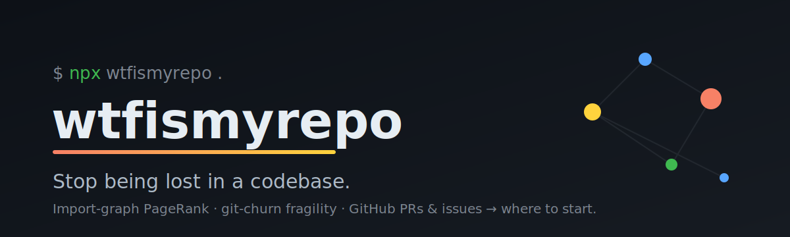

<p align="center">
  <a href="https://github.com/nandnijaiswal/wtfismyrepo">
    
  </a>
</p>

# wtfismyrepo — onboarding for agents & humans

[](https://github.com/nandnijaiswal/wtfismyrepo/actions/workflows/ci.yml)
[](./test)
[](./LICENSE)
[](./documentation/install.md)
[](https://github.com/nandnijaiswal/wtfismyrepo/stargazers)

> **You just got dropped into a 200k-line codebase. You have no idea what's going on. This fixes that.**

Most "explain my code" tools read the code and stop — but code only tells you *what* exists. The *why*, and the *landmines*, live in the **structure** and the **history**. **wtfismyrepo treats onboarding as a graph problem, not a reading problem** — it builds an import graph, runs **PageRank** to find the files that hold the system together, scores **fragility** from git churn, and reads the **GitHub history** (open PRs = hot zones, issues = pain) to tell you *exactly where to start*.

It ships as both a **CLI/library** (the deterministic engine) and a **Claude Code skill** (the guided, part-by-part explanation).

Reach for it whenever you're **new to a repo**, **lost**, **inheriting legacy code**, or thinking *"where do I even start with this?"*

---

## Side-by-side: day one, lost vs. wtfismyrepo

<table>
<tr>
<th width="50%">🟦 The manual way</th>
<th width="50%">🟧 wtfismyrepo</th>
</tr>
<tr valign="top">
<td>

Clone the repo. Open the file tree. **47 top-level folders.**

Read a `README` that's three years stale. Grep around for `main`. Open twelve files, lose the thread, close eleven. Try to guess which module is load-bearing and which is dead.

No idea what's safe to touch. No idea what's changing under you right now. No idea what to work on first.

So you `git blame`, ask in Slack, and quietly hope nobody notices you've been "ramping up" for a week.

**What's missing:** any *signal*. Every file looks equally important when you've never seen the repo before.

</td>
<td>

```bash
npx github:nandnijaiswal/wtfismyrepo .
```

In seconds you get:

- **The spine** — the structurally central files (PageRank over the import graph). *Read these first.*
- **Handle-with-care** — files that are central *and* high-churn (most likely to bite you).
- **Hot zones** — files under open PRs you'd collide with.
- **Good first issues** — pulled straight from GitHub.
- **"Your first move"** — a concrete file to open and a safe first task.

Signal, not 47 folders. You know where to start before lunch.

</td>
</tr>
</table>

---

## What you get

Unedited output, run on this very repo:

```
━━ THE SPINE — most central files (PageRank) ━━━━━━━━━━━━━━━
  read these first; everything depends on them
  ██████████ src/install.mjs
  █████████░ src/graph.mjs
  █████████░ src/pagerank.mjs
  ████████░░ src/detect.mjs
  █████░░░░░ src/git.mjs

━━ THE HISTORY — what's happening on GitHub ━━━━━━━━━━━━━━━━
  🔥 0 open PRs (hot zones — avoid surprising people)
  🩹 3 open issues (where it hurts)
     #3 Per-directory responsibility summaries
     #2 gh-free history via GitHub REST API
     #1 Add Rust import parsing
  🌱 good first issues — START HERE:
     #1 Add Rust import parsing

━━ YOUR FIRST MOVE ━━━━━━━━━━━━━━━━━━━━━━━━━━━━━━━━━━━━━━━━━
  1. Open bin/wtfismyrepo.mjs and read top-to-bottom.
  2. Then trace into src/install.mjs — it's the spine.
  3. Pick up issue #1: "Add Rust import parsing".
```

> The **Handle-with-care / fragility** pass (`centrality × git-churn`) needs commit history to light up — it's empty on a one-commit repo like this one, and ranks the genuinely risky files on any mature codebase.

---

## Install

One command — installs the skill into your Claude Code agent (no npm account needed):

```bash
npx github:nandnijaiswal/wtfismyrepo install
```

Restart Claude Code, then just ask: **"wtf is this repo"** · **"I'm new here, where do I start?"**

| Variant | What it does |
|---|---|
| `... install` | Personal install (`~/.claude/skills/`) — all projects |
| `... install --project` | This repo only (`./.claude/skills/`) |
| `... uninstall` | Remove it |

Using Cursor / Codex / another agent? Add `@~/.claude/skills/wtfismyrepo/SKILL.md` to your `CLAUDE.md` / `AGENTS.md` / `.cursorrules`. Full matrix in **[documentation/install.md](./documentation/install.md)**.

---

## Quickstart

**CLI:**

```bash
npx github:nandnijaiswal/wtfismyrepo .          # analyze the repo you're in
wtfismyrepo . --json                            # machine-readable (what the skill consumes)
wtfismyrepo ../service --no-history --top 5      # offline, just the top 5
```

**Library:**

```ts
import { analyze, renderText } from "wtfismyrepo";

const report = analyze(".", { history: true, top: 10 });
console.log(renderText(report));
// report.importance · report.fragility · report.hotZones · report.entryPoints · report.history
```

Full reference: **[documentation/api.md](./documentation/api.md)**.

---

## How it works

```
 files ─► import parser ─► directed import graph ─► PageRank ──┐
                                                               ├─► importance ranking (the spine)
   git log ───────────────► per-file churn ───────────────────┤
                                                               └─► fragility = centrality × churn
   gh CLI ──► open PRs (hot zones) + issues (pain) ──────────────► where to start
```

1. **Scan** — list git-tracked files (respects `.gitignore`), read parseable sources (JS/TS/JSX/Python/Go).
2. **Graph** — parse real `import` / `require` / `from` statements, resolve to internal files, build a who-depends-on-whom graph.
3. **PageRank** — power iteration with damping + dangling-node handling. High rank = the spine.
4. **Churn** — `git log` change-frequency per file.
5. **Fragility** — `normalize(centrality) × normalize(churn)`. Central *and* churned = handle with care.
6. **History** — `gh` pulls open PRs (→ hot zones), merged PRs (→ conventions), issues (→ pain & good-first-issues).
7. **Report** — terminal or `--json`, ending in a concrete *"Your first move."*

The engine is [tested](./test) (PageRank correctness, import parsing, scoring, install) and runs in CI on Node 18 / 20 / 22. Deep dive: **[documentation/how-it-works.md](./documentation/how-it-works.md)**.

---

## Documentation

| Page | What's in it |
|---|---|
| [Install](./documentation/install.md) | Every install path — skill, CLI, library, per-agent |
| [How it works](./documentation/how-it-works.md) | The pipeline, the algorithm, why the skill matters |
| [CLI & API](./documentation/api.md) | CLI flags, library types, the `Analysis` object |

Also: [SKILL.md](./SKILL.md) — the runnable Claude Code skill.

---

## Project layout

```
bin/wtfismyrepo.mjs   CLI entry (analyze · install · uninstall)
src/
  index.mjs           public library surface
  analyze.mjs         orchestrator
  scan.mjs            file discovery + source reading
  graph.mjs           import parsing + resolution
  pagerank.mjs        the PageRank algorithm
  git.mjs             churn + tracked files
  fragility.mjs       importance + fragility scoring
  entrypoints.mjs     entry-point detection
  history.mjs         gh PR/issue signals
  report.mjs          terminal + JSON rendering
  install.mjs         skill installer
SKILL.md              the Claude Code skill
documentation/        docs · test/ unit tests · .github/ CI
```

---

## Roadmap & contributing

This is a young project — early issues and PRs are especially welcome:

- [ ] Rust / Java / Ruby import parsing
- [ ] `gh`-free history via the GitHub REST API
- [ ] Per-directory "responsibility" summaries
- [ ] Published to npm (`npx wtfismyrepo`, no `github:` prefix)
- [ ] HTML/JSON export of the onboarding report

Found a repo where the spine ranking looks wrong, or a language it should parse? [Open an issue](https://github.com/nandnijaiswal/wtfismyrepo/issues/new) — those are the most useful contributions right now.

---

## Star History

<a href="https://www.star-history.com/#nandnijaiswal/wtfismyrepo&Date">
  
</a>

---

## License

MIT © [Nandni Jaiswal](https://github.com/nandnijaiswal)

The deterministic engine lives in [`src/`](./src); the runnable skill is [`SKILL.md`](./SKILL.md). Go forth and stop being lost.
